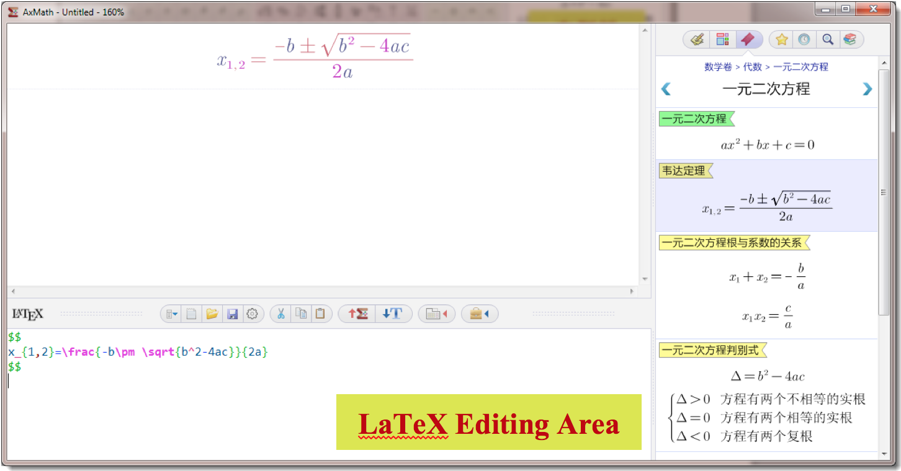

# 2. Main Interface

According to the editing mode, AxMath has 2 main interfaces, "Equation Editor Area + Symbol Panel + Sidebar" or "Equation Editor Area + LaTeX Editor Area + Sidebar". Where the right sidebar can be closed.

Figure 2.1 Interface Mode 1: Equation Editor Area + Symbol Panel + Sidebar

Figure 2.2 Interface Mode 2: Equation Editor Area + LaTeX Editor Area + Sidebar