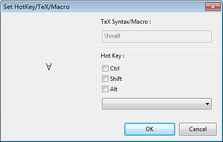
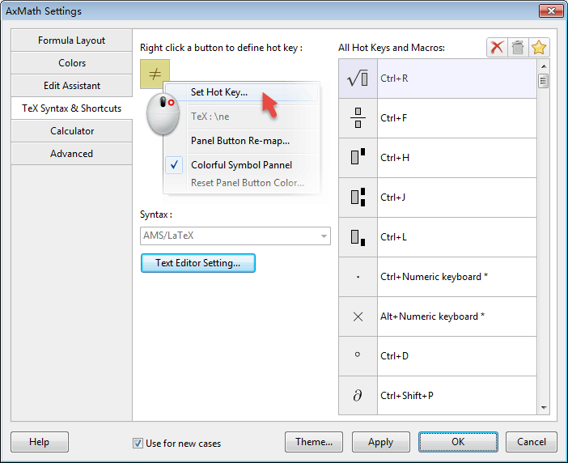
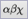
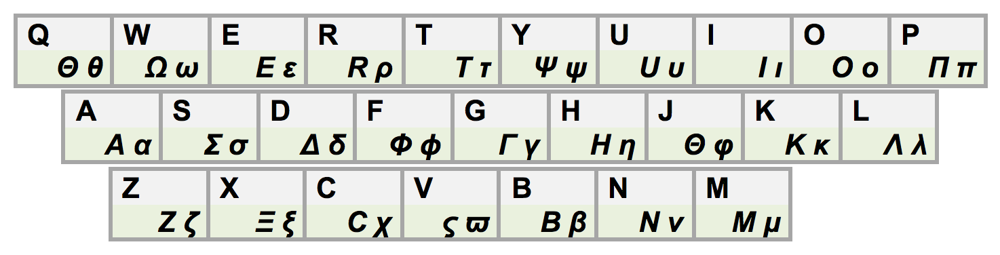
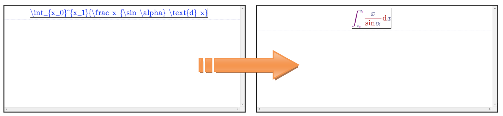
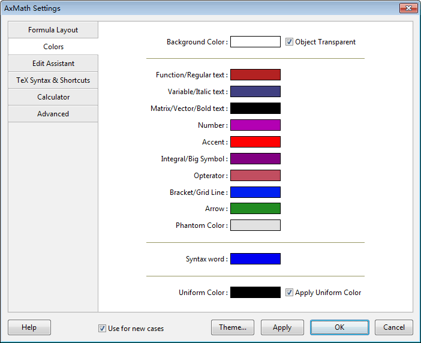

# 3. Equation Editor

## 3.1 Basic Operations

### 3.1.1 WYSIWYG (What you see is what you get)

WYSIWYG is the basic editing mode of AxMath. In the equation editing area, you can edit your equations like any other text editors. When you need special math symbols, you can simply click and choose, using shortcuts or using mixed-LaTeX to quickly insert.

The cursor shows the current editing position. You can use mouse click, Home Key, End Key and four arrow keys to move your cursor.

### 3.1.2 Active text styles

The toolbar button () indicates the current active text style. They can combine as normal, italic, bold, italic and bold 4 styles.

### 3.1.3 Modify text styles

If you want to change the text styles, you can choose the text and use right click menu or these toolbar () buttons to modify, corresponding to the shortcuts Ctrl+1/2/3/4.

### 3.1.4 Use mouse wheel to control view

When the pointer is in the editing area, you can move your mouse wheel up or down to scroll the view, and move the wheel while pressing Shift Key to move left or right. And move the wheel while pressing Ctrl to zoom in and out.

## 3.2 Symbol Panel

### 3.2.1 Symbol panel scroll and group switch

AxMath uses scrollable panels to display all math symbols. The symbols are classified by different groups and you can either click the panel tag or use mouse wheel to switch over. Click the symbol and then it will appear in the editing position.

Of course you can customize the panels  order by right clicking the panels.

### 3.2.2 Set up the appearance and colors of the symbol panel

The symbol panels can be easily customized. First right click any symbol on the panel, than choose "Appearance" in the popup menu, and you can see an appearance setting dialog.

Symbol panels support multiple backgrounds, making it easy to distinguish. Right click any symbol on panel, and you can set multi-background and the panel background.

### 3.2.3 Symbols re-mapping and symbol panel expansion

Some groups of symbol panel (binary operator) contains numerous symbols, by default you can only see the frequently-used symbols. Thus you need to click () to expand all symbols. These panels also allows you to re-mapping the symbol positions, you can right click the symbol button to define them as you wish.

## 3.3 Shortcuts

### 3.3.1 Define shortcuts

Figure 3.1

All math symbols on panel can bind a shortcut(hotkey). On the symbol panel, you can right click a symbol button and then a menu pops up. Choose "Set Hotkey" and appear a "Set HotKey/TeX/Macro" dialog, then you can set the shortcuts.
Shortcuts are the combinations of auxiliary key and main key. Auxiliary key includes `Ctrl`, `Alt`, `Ctrl+Shift`, `Ctrl+Shift`, `Alt+Shift` and `Ctrl+Alt+Shift`, main keys can be chosen from the drop-down box. They can be characters, numbers, punctuations or arrow keys. Shortcuts are case insensitive. Notice: the system reserved shortcuts can't be redefined, e.g. `Ctrl+C` represents copy.

You can right click the symbol panel to view the shortcuts. Also you can click  to set up and modify it in "Syntax and shortcuts" tab control.
### 3.3.2 Default shortcuts

table

## 3.4 Quick input Greek symbols

### 3.4.1 Greek keyboard

Click the () button on toolbar. The current keyboard will switch to Greek keyboard, which can continuously input Greek symbols.

### 3.4.2 Temporary switch of Greek keyboard 

When in the state of English Keyboard, press shortcut "Ctrl+G" you can temporarily switch to Greek keyboard, and it will return to the normal state after input a character. For example, press "Ctrl+G", "d", "e", the editing area will output "$$$\delta\epsilon$$$".

Figure 3.2 Comparison of Greek Keyboard

### 3.4.3 Mixed LaTeX Syntax
Press the button () and the current keyboard will change into the English keyboard with LaTeX syntax support. You can type with LaTeX syntax to enter Greek symbols, e.g. "\alpha", press enter and it will turn into Greek symbol "$$$\alpha$$$".

## 3.5 Use LaTeX to input equations 

### 3.5.1 LaTeX syntax editor
Click the toolbar button () or press shorcut "Ctrl+Tab" to switch to LaTeX editing mode. You can type in LaTeX script within the bottom area of the interface. Then press the () button or press "Shift+Enter", it will convert the LaTeX script into equation.
Press the () button on toolbar, will re-convert the equation into LaTeX script.
Syntax editor can highlight both the symbols and syntax. Within the script editing area, right click and trigger the popup menu, then choose "text editor preferences" and open a setup dialog. You can also press () button and open the dialog in "Syntax and Shortcuts" tab.
### 3.5.2 Mixed LaTeX Syntax 
Press the toolbar button () and then switch to the LaTeX syntax English keyboard. Now you can type in escape characters such as "\", "^" or "_", the following strings will turn into blue, press "Enter" and the blue part will be converted into equations according to LaTeX syntax.

Figure 3.3 Equation by Mixed LaTeX syntax

## 3.6 Editor's Auxiliary functionalities

### 3.6.1 Auto correction of function's font

The font styles of AxMath includes normal(A), italic(A), bold(A) and italic-bold(A). AxMath offers the auto-correction functionality which enables the matching field change into the pre-defined styles. For example, the pre-defined style of "sin" is normal, when you enter "sin" string, the font will automatically change into normal.

Press the toolbar button (), in the "editor auxillary functions" tab press the top-right toolbar or use the right-click menu you can add or edit the pre-defined functions.

AxMath has many pre-defined functions which can be loaded by "load default" on toolbar.

### 3.6.2 Other auxiliary functionalities
AxMath also offers auto-correction of characters, numbers, punctuations and halving line. Press the () button on the toolbar, you can turn on or turn off these functions.

## 3.7 Clipboard and drag & drop

### 3.7.1 Composite clipboard

### 3.7.2 Plain-text clipboard

### 3.7.3 Paste
 
### 3.7.4 Drag & drop

## 3.8 Sidebar Tools: Notes, Magnets and References (Formula Warehouse)

### 3.8.1 Notes

### 3.8.2 Magnets

### 3.8.3 References (Formula warehouse)

### 3.8.4 Formula warehouse list and edit

### 3.8.5 Reference list usage and edit

### 3.8.6 Sharing formula

## 3.9 Color Setup

### 3.9.1 Single/Multi color trigger
AxMath support both single and multi color display. Press the toolbar button () to switchover.

### 3.9.2 Color preferences

Figure 3.5 Color preferences

## 3.10 Find and Replace

### 3.10.1 String find and replace

### 3.10.2 Global find and replace

### 3.10.3 Erase the find mark

## 3.11 Quick Matrix Template

