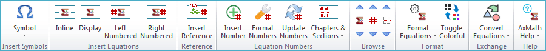

# 6. Equation Output and Word Plugin

## 6.1 Output as a Figure

Use the "export figure" button() in main menu or right click the equation editing area, you can export the equation as a figure. AxMath supports the following figure types:

* Enhanced MetaFile (*.EMF)
* Bitmap (*.BMP)
* Joint Photographic Experts GROUP (*.JPG)
* Graphics Interchange Format (*.GIF)
* Portable Network Graphic Format (*.PNG)
* Tagged Image File Format (*.TIFF)

## 6.2 Capture Figure to Clipboard

You can use the right-click menu in the equation editing area and capture the AxMath equation as a figure to system clipboard. The capture supports both bitmap or vector format.

## 6.3 Insert OLE Objects

OLE stands for "Object Linkingand Embedding", which is a proprietary technology developed by Microsoft that allows embedding and linking to documents and other objects. 

AxMath equations can be inserted as OLE objects and all softwares support OLE can insert AxMath equations. 

## 6.4 AxMath Addon Menu on Word

If you have installed Word, by default after installing AxMath, you'll see the AxMath addon menu on the Word ribbon.

The addon menu offers equations insertion, management, numbering, mass manipulation and other utilities. It can improve your efficiency significantly.

### 6.4.1 Insert equation in Word 

Using the addon menu, you can insert either style of the 4 types of equations.

1. Inline: Inline equations, used for mixed typesetting 
2. Display: Display equations, standalone and centered
3. Left Numbered: Left-numbered equations, standalone and centered
4. Right Numbered: Right-numbered equations, standalone and centered

### 6.4.2 